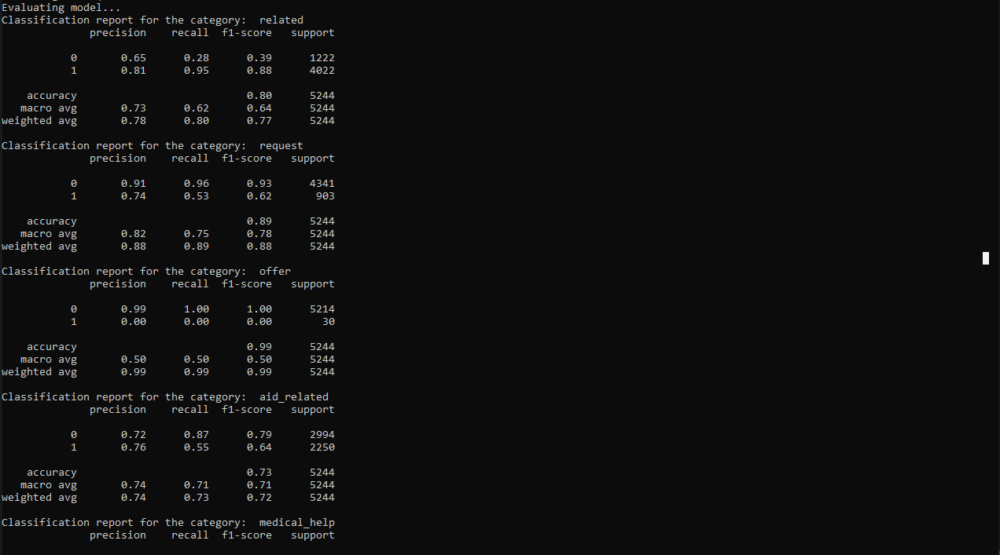
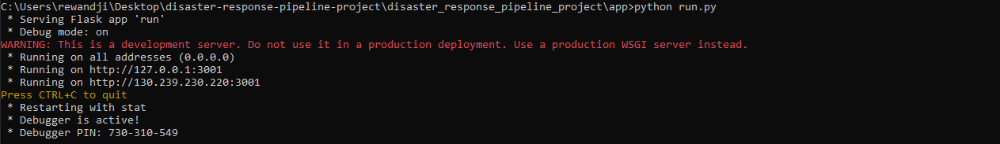

# Disaster Response Pipeline Project (Udacity - Data Science Nanodegree)


## Table of Contents
1. [Description](#description)
2. [Getting Started](#getting_started)
	1. [Dependencies](#dependencies)
	2. [Installing](#installation)
	3. [Executing Program](#execution)
	4. [Additional Material](#material)
3. [Authors](#authors)
4. [License](#license)
5. [Acknowledgement](#acknowledgement)
6. [Screenshots](#screenshots)

<a name="descripton"></a>
## Description

This project is part of Udacity's Data Science Nanodegree, utilizes a dataset of pre-labeled disaster-related tweets and messages. The goal is to develop a real-time Natural Language Processing (NLP) model for message categorization.

The project consists of three main components:

1. Data processing: Creating an ETL pipeline to extract, clean, and store data in a SQLite database
2. Machine learning: Developing a pipeline to train a multi-category text classification model
3. Web application: Implementing a real-time interface to showcase the model's results

<a name="getting_started"></a>
## Getting Started

<a name="dependencies"></a>
### Dependencies
* Python 3.5+
* Machine Learning Libraries: NumPy, SciPy, Pandas, Sciki-Learn
* Natural Language Process Libraries: NLTK
* SQLlite Database Libraqries: SQLalchemy
* Model Loading and Saving Library: Pickle
* Web App and Data Visualization: Flask, Plotly

<a name="installation"></a>
### Installing
To clone the git repository:
```
git clone https://github.com/romy651/disaster_response_pipeline_project.git
```
<a name="execution"></a>
### Executing Program:
1. You can run the following commands in the project's directory to set up the database, train model and save the model.

    - To run ETL pipeline to clean data and store the processed data in the database
        `python data/process_data.py data/disaster_messages.csv data/disaster_categories.csv data/disaster_response_db.db`
    - To run the ML pipeline that loads data from DB, trains classifier and saves the classifier as a pickle file
        `python models/train_classifier.py data/disaster_response_db.db models/classifier.pkl`

2. Run the following command in the app's directory to run your web app.
    `python run.py`

3. Go to http://0.0.0.0:3001/

<a name="material"></a>
### Additional Material

In the **data** and **models** folder you can find two jupyter notebook that will help you understand how the model works step by step:
1. **ETL Preparation Notebook**: learn everything about the implemented ETL pipeline
2. **ML Pipeline Preparation Notebook**: look at the Machine Learning Pipeline developed with NLTK and Scikit-Learn

You can use **ML Pipeline Preparation Notebook** to re-train the model or tune it through a dedicated Grid Search section.

<a name="importantfiles"></a>
### Important Files
**app/templates/***: templates/html files for web app

**data/process_data.py**: Extract Train Load (ETL) pipeline used for data cleaning, feature extraction, and storing data in a SQLite database

**models/train_classifier.py**: A machine learning pipeline that loads data, trains a model, and saves the trained model as a .pkl file for later use

**run.py**: This file can be used to launch the Flask web app used to classify disaster messages

<a name="authors"></a>
## Authors

* [Romuald Esdras Wandji](https://github.com/romy651)

<a name="license"></a>
## License
[](https://opensource.org/licenses/MIT)

<a name="acknowledgement"></a>
## Acknowledgements

* [Udacity](https://www.udacity.com/) for providing an amazing Data Science Nanodegree Program
* [Figure Eight](https://www.figure-eight.com/) for providing the relevant dataset to train the model

<a name="screenshots"></a>
## Screenshots

1. Main page shows the Overview of Training Dataset & Distribution of Message Categories


2. Enter message and click 'Classify Message' to see the categories which the message belongs to highlighted in green


3. Sample run of process_data.py


4. Sample run of train_classifier.py




5. Run run.py in app folder to see the web app in action

